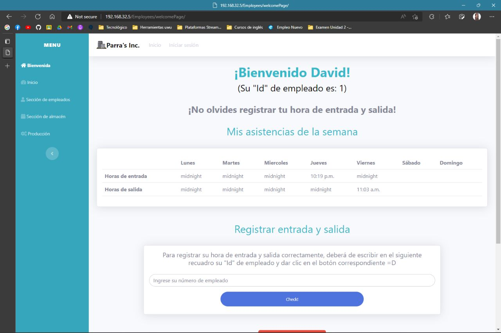
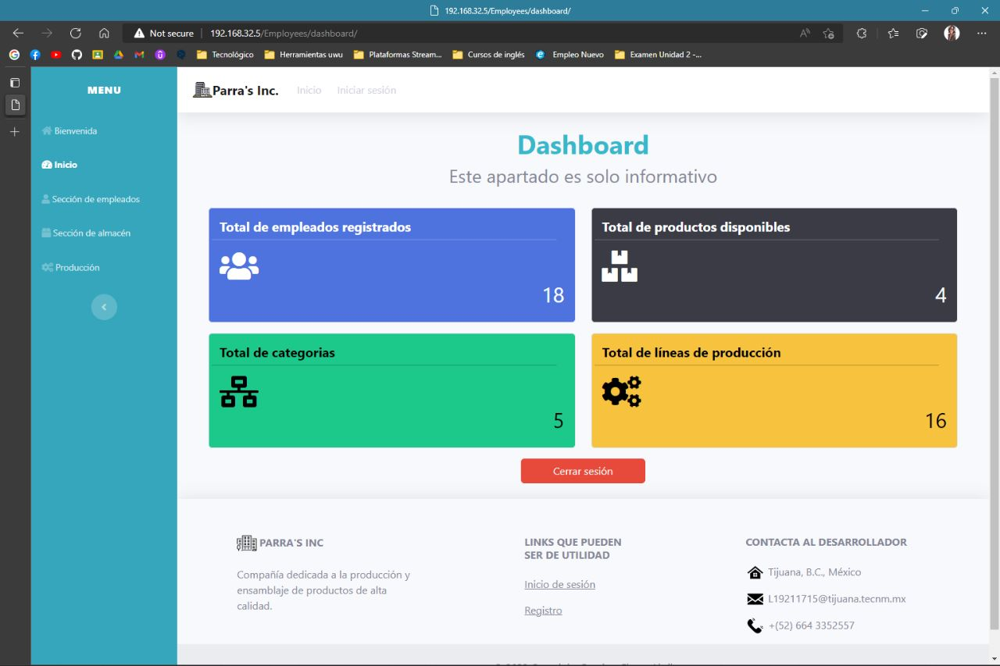
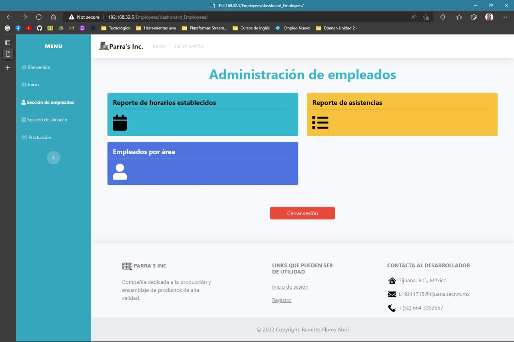
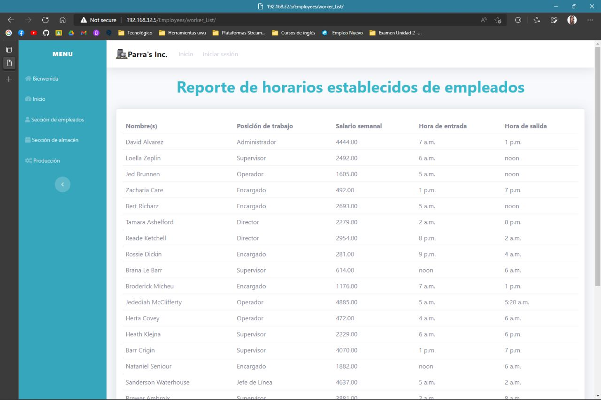
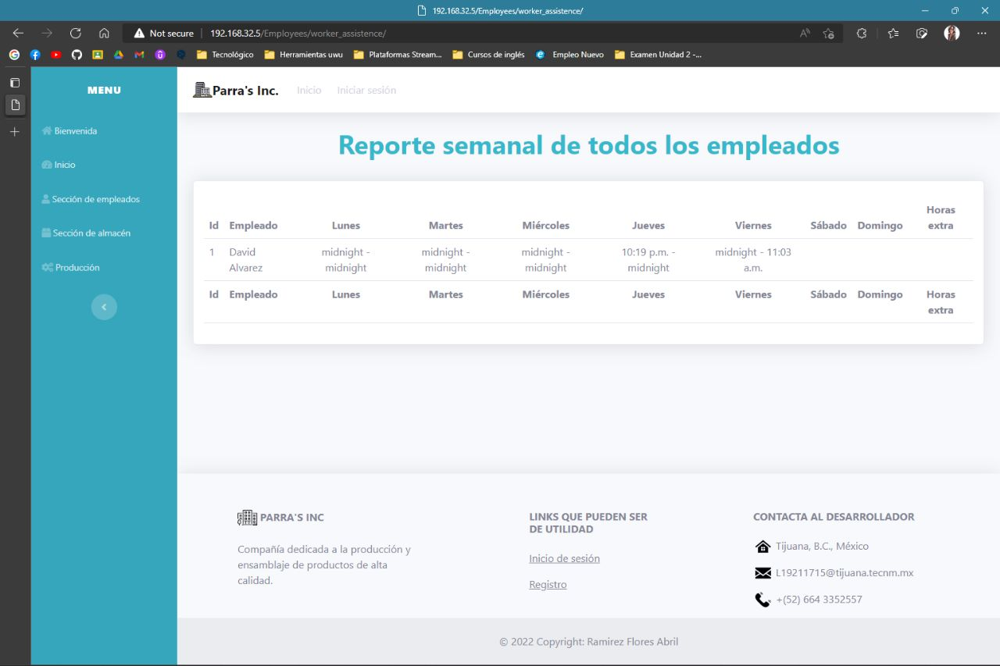
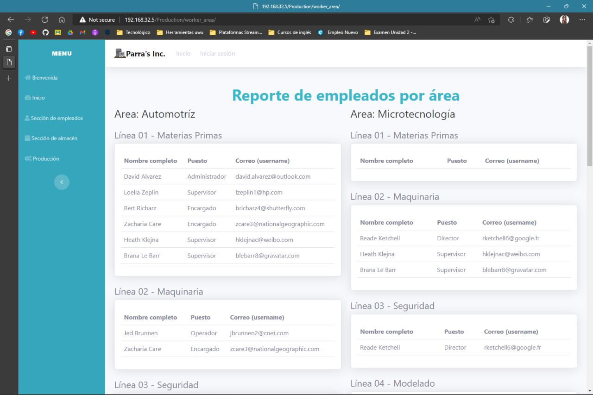
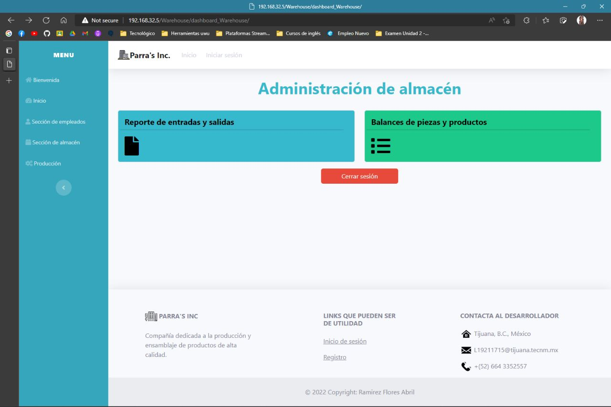
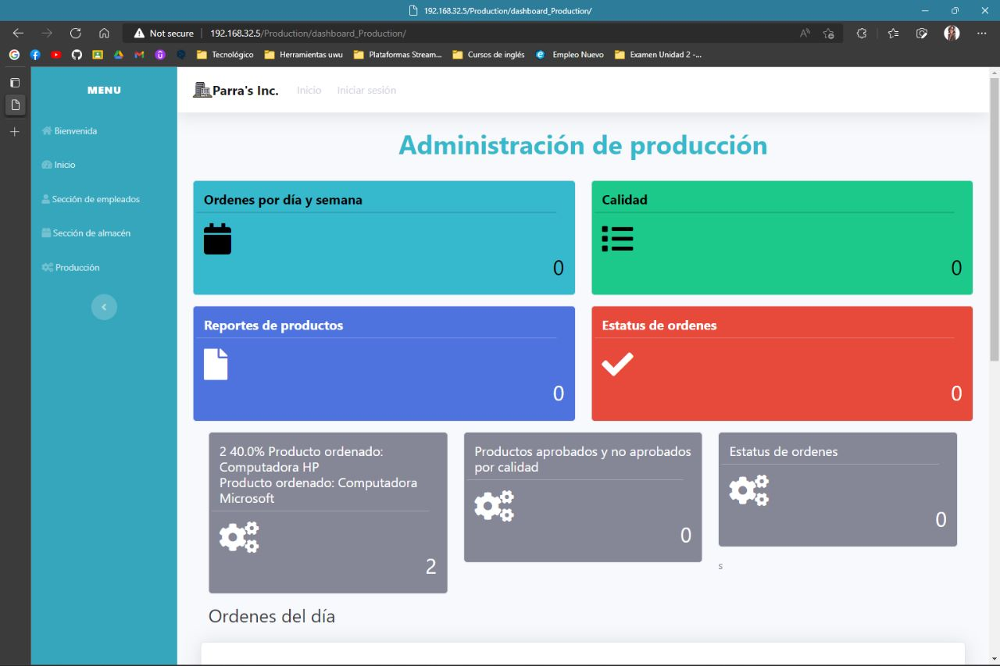
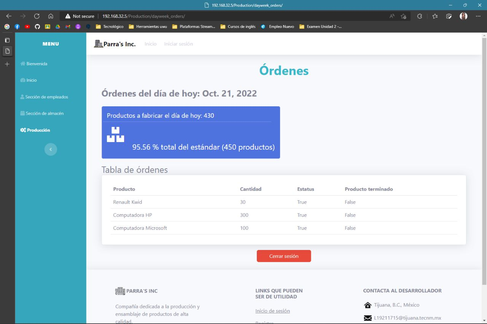

# Parra's Inc :office:

## Proyecto - Examen correspondiente a la Unidad 2 de la materia de Programación Web

### **|-----| Descripción |-----|**
Parra's Inc. tiene 8 líneas de producción en el área automotriz y 8 líneas de producción en el área de micro-tecnología. Existen 3 jefes de línea en cada una de las líneas y 3 jefes de calidad en cada área. El problema radica en que todos los procesos de información
entre el almacén, las líneas de producción y el departamento de calidad son manuales. La empresa necesita sistematizar estos procesos para obtener una serie de reportes que permitan describir el avance en eficiencia y calidad a los gerentes de la empresa.

### **|----- Proyecto realizado |-----|**
El proyecto que se realizó fue un sitio web de administración, el cual cuenta con 5 secciones distintas. A continuación, se mostrarán cada una de ellas:

### **|----- Secciones ----|**
#### **-----> PÁGINA DE BIENVENIDA <-----**

  

Una vez que el empleado haya iniciado sesión, esta será la primera página que vería. En ella, deberá escribir su ID de empleado para registrar tanto su hora de entrada, como de salida. En la parte superior podrá visualizar sus asistencias de la semana.
Si así lo desea, en la parte inferior de la página, el empleado contará con un botón de "Cerrar sesión" para poder salir de la página.

#### **-----> SECCIÓN DE INICIO <-----**

  

La segunda sección de la página es la de "Inicio", la cual es sólo informativa. En ella, el usuario podrá visualizar el total de empleados registrados, productos disponbles, categorías de productos y total de líneas de producción.

#### **-----> SECCIÓN DE EMPLEADOS <-----**

  

Para esta tercera sección del sitio web tenemos a la de nombre "Administración de empleados". En esta se muestran 3 botones que dirigirán al usuario a 3 "sub-secciones", las cuales constan de 3 reportes distintos:

##### -> REPORTE DE HORARIOS ESTABLECIDOS

  

En esta "sub-sección", el usuario podrá visualizar los horarios establecidos para cada empleado de la empresa, así como también, su posición de trabajo y salario semanal.

##### -> REPORTE DE ASISTENCIAS

  

En esta "sub-sección", el usuario podrá visualizar el reporte semanal de todos los empleados de la empresa, mostrando en forma de calendario semanal sus horas de entrada y salida. En dado caso de haber cumplido con horas extra, se calcularán de manera automática.

##### -> REPORTE DE AREAS

  

En este reporte, el usuario podrá conocer cuántos empleados existen en cada línea de producción de las áreas existentes. Para cada empleado se mostrará su nombre completo, puesto y correo.

#### **-----> SECCIÓN DE ALMACÉN <-----**

  

Para esta cuarta sección del sitio web tenemos a la de nombre "Administración de almacén". En esta se muestran 2 botones que dirigirán al usuario a 2 "sub-secciones", las cuales constan de 2 reportes distintos.

#### **-----> SECCIÓN DE PRODUCCIÓN <-----**

  

Esta última sección es solamente informativa. El usuario podrá visualizar cómo va el departamento de producción, como por ejemplo, conocer el total de órdenes por día y semana. Como una funcionlidad extra, se podrá visualizar un reporte de órdenes por día/

##### -> REPORTE DE ÓRDENES DIARIAS

  

En este reporte, como su nombre lo indica, se muestran las órdenes totales del día. En la parte superior se muestra la cantidad de órdenes y el porcentaje total del estándar de fabricación. En la parte inferior se muestra en forma de tabla la lista de productos a
fabricar, mostrando el nombre del producto, la cantidad a fabricar y el estatus en el que se encuentra.

### **|-----| Acerca del autor |-----|**
#### **Nombre.**
_Ramirez Flores Abril._
#### **Perfil de Github.** :octocat:
[iscRamirezAbril](https://github.com/iscRamirezAbril)
#### **Profesión.**
_Estudiante de 7mo semestre en Ingeniería en Sistemas Computacionales._
